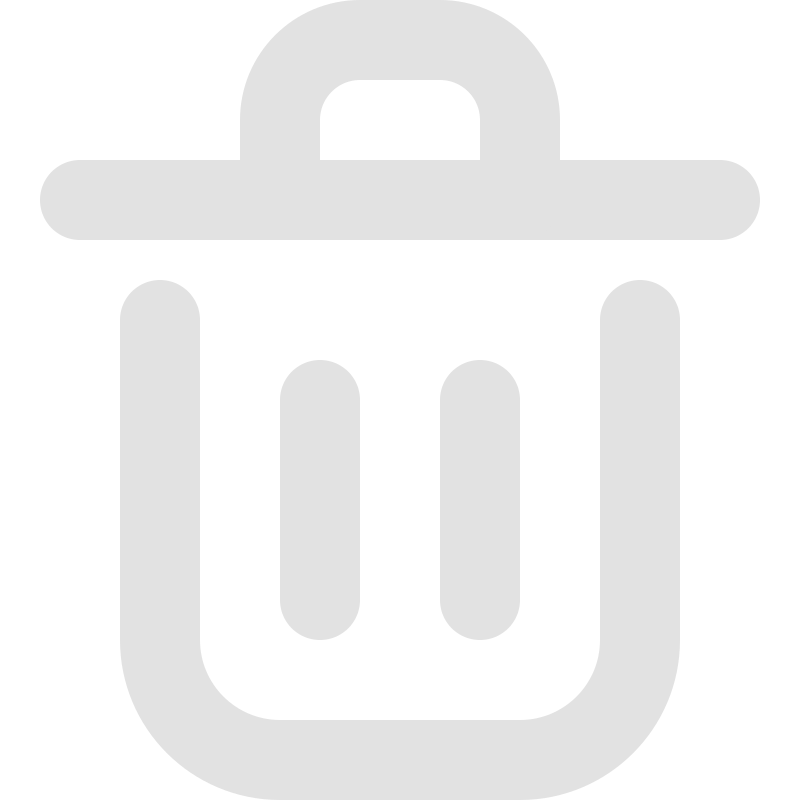

# AudioRecorder
## BY Sertis:
+ AlexRivasMachín 🌶️
+ gomezBc 🥥
+ MartinLopezDeIpina 🍍
## Documentación 📃
### ¿Que hace nuestra app?
+ Nuestra aplicación es una herramienta para la grabacíon y reproducción de audio.
### ¿Que elementos tiene?
+ Tiene un menu de navegación vertical para tener información del audio y todo lo que pasa en todo momento. También el menu de reproducción es intercactivo.

### Index.hmtl 🏗️
```
    <section class="audio-area">
      <div class="audio-toolbar">
        <h1>Tus Audios</h1>

        <div class="recent">
          <h3>Audios recientes</h3>
          <div id="recent-list"></div>
        </div>

        <ul id="Recent Records"></ul>

        <div class="liked">
          <h3>Audios destacados</h3>
          <div id="liked-list"></div>
        </div>
      </div>

      <div class="audioElements">
        <div class="audio-recorder">
          
          <div id="recorded-time">
            
            <h2 id="timer">00:00:00</h2>
          </div>
          <audio id="audio"></audio>
        </div>

        <div id="status-buttons">
          
          
          
        </div>
      </div>
    </section>
```
### JavaScript 🐷
Antes la estructura de JS se basa en tres tipos de clases: El servidor , los scripts y las clases de objetos. Pese a tener que usar clases de objetos por ahora solo tenemos la clase timer, debido a esto para la siguiente entrega del proyecto habrá una refactorización en varias clases para que quede mas claro el rol de cada cosa. El botón para compartir el audio si que está en una clase aparte, ya que lo hemos implementado recientemente.
#### APP.js
Su objetivo es inicializar el servidor, tiene los "path" a los ficheros que va a usar. Esta desarrolado con express.js (un frameword de Node). Su código es simple por ahora: 
```JS
const express = require('express');
const app = express();
const path = require('path');
const port = 5000;

app.use(express.static(path.join(__dirname, 'public')));

app.get('/', (req, res) => {
    res.sendFile(path.join(__dirname, 'index.html'));
});

app.listen(port, () => console.log(`Example app listening on port ${port}!`));
```

### Script.js
Esta clase maneja el comportamiento de toda la app excepto el timer. Por una parte tenemos los métodos para --- y ---. Sabemos que la implementación no es exactamente la especifícada en el PDF a seguir, pero en cuanto a funcionalidad hemos cubierto todo. Para la siguiente versión del proyecto añadiremos o modificaremos los métodos como sea necesario.
Para entender este código lo vamos a dividir en varias etapas: 
#### 1. Import e inicialización de variables u objetos
```JavaScript
import uuidv4 from '../utils/uuid/v4.js';
import Timer from './timer.js';
import ShareBtn from '../js/shareButton.js';

const timer = new Timer(document.getElementById('timer'));
const recorder = document.getElementById('recorder-status');
const recordingImg = document.getElementById('recording-img');
const recentList = document.getElementById('recent-list');
const cloudList = document.getElementById('cloud-list');
const buttonRecordState = document.getElementById('imageBackToRecording');
const buttonCloudActions = document.getElementById('imageCloudActions');
const buttonDeleteRecording = document.getElementById('imageDeleteRecording');
const buttonShareRecordingInstance = new ShareBtn();
const statusButtons = document.getElementById('status-buttons');

let audioPlayer;
let mediaRecorder;
let audioChunks = [];
let uuid;

const buttonShareRecording = statusButtons.appendChild(buttonShareRecordingInstance.img);
```
#### 2. Generación del UUID e inicialización
```JavaScript
//generar uuid
if (!localStorage.getItem("uuid")) {

    localStorage.setItem("uuid", uuidv4());

}

uuid = localStorage.getItem("uuid");
console.log(uuid);
```
#### 3. Inicialización del audio y listeners de eventos
#### 4. State del recorder y gestión de funciones
#### 5. Gestión del estado en la nube
#### 6. Función para gestión de las entradas de audio
#### 7. Funciones para la grabación de audio
#### 8. Listeners y lista de audios
